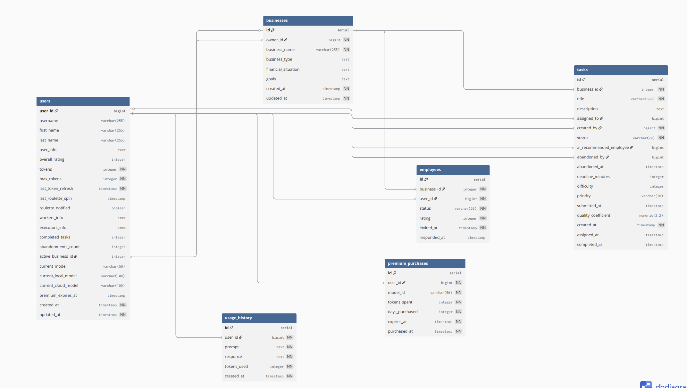

# 🚀 AI Business Manager Bot - Альфа Хак

> Telegram бот с AI для комплексного управления бизнесом

[](https://opensource.org/licenses/MIT)
[](https://www.python.org/downloads/)
[](https://www.postgresql.org/)

**Telegram бот:** [@hackathonchik_bot](https://t.me/hackathonchik_bot)

## 📋 Оглавление

- [Быстрая установка](#-быстрая-установка)
- [О проекте](#-о-проекте)
- [Ключевые возможности](#-ключевые-возможности)
- [Архитектура](#архитектура)
- [Интеграция с Альфа-Банком](#-интеграция-с-альфа-банком)
- [База данных](#-база-данных)
- [Масштабируемость](#-масштабируемость)

## ⚡ Быстрая установка

> **Подробная инструкция:** См. [SETUP.md](SETUP.md) для пошаговой установки за 5 минут


## 🎯 О проекте

**@hackathonchik_bot** - интеллектуальный Telegram-бот для управления малым и средним бизнесом с интеграцией AI.

### Проблема
- 📊 Отсутствие доступных инструментов финпланирования
- 👥 Сложность поиска клиентов и исполнителей
- 🔄 Неэффективное управление командой
- 💰 Высокая стоимость бизнес-консультантов

### Решение
AI-платформа в Telegram для:
- ✅ Автоматического создания финансовых планов
- ✅ Интеллектуального поиска клиентов и партнёров
- ✅ Управления сотрудниками и задачами
- ✅ Получения бизнес-консультаций 24/7

## ✨ Ключевые возможности

### 🤖 AI Ассистент
- Умный чат-бот для бизнес-вопросов
- Контекстная помощь по специфике бизнеса
- AI рекомендации по задачам
- **Модель:** Локально Llama-3-8B-Instruct-Finance-RAG-GGUF,  с возможностью переключится на openrouter Llama 3.3 70B Instruct

### 📊 Финансовое планирование
- Интерактивный опрос (4 ключевых вопроса)
- AI-анализ и создание стратегии
- Профессиональный PDF-отчёт
- Персонализация под отрасль

### 👥 Управление командой
- Возможность нанимать сотрудников через Telegram username и увольнять их
- Система приглашений с подтверждением
- Мультибизнес - работа у нескольких владельцев
- Создание нескольких бизнесов
- Рейтинг исполнителей с умным подбором

### 📋 Управление задачами
- **AI-подбор исполнителя** на основе истории выполнения задач и затраченного времени
- Статусы: available → in_progress → completed
- Дедлайны по задачам и приоритеты
- Можно назначить работу сотруднику
- Сотрудники могут брать задачи самостоятельно и могут от  них отказываться
- Подтверждение выполнения владельцем с возможностью дать обратную связь
- Результат выполнения задачи влияет на рейтинг сотрудника

### 🔍 Поиск возможностей
- **Поиск клиентов** - AI анализирует потребности и дает рекомендации
- **Поиск исполнителей** - AI подбор подрядчиков и фрилансеров
- **Поиск партнёров** - AI находит схожие бизнесы среди пользователей бота

### 💰 Система токенов

Внутренняя валюта для управления использованием AI:

```
Регистрация → 50 токенов
     ↓
AI запрос → 1-3 токена
     ↓
24 часа → Добавка 10  токенов и возможность прокрутить рулетку с максимальным призом в 50 токенов
```

**Зачем нужна:**
- 🛡️ Защита от злоупотреблений AI
- ⚖️ Справедливое распределение ресурсов
- 💰 Возможность монетизации
- 📊 Контроль расходов на AI

## 🏗️ Архитектура

### Общая схема

```
┌──────────────┐
│  Telegram    │
│    User      │
└──────┬───────┘
       │
   ┌───▼──────────────────────────┐
   │   bot.py                     │──► Telegram handlers, conversation flows
   │   (Telegram Layer)           │
   └───┬──────────────────────────┘
       │
   ┌───▼──────────────────────────┐
   │  Business Logic Layer        │
   │                              │
   │  • ai_client.py          ────┼──► AI запросы через OpenRouter
   │  • user_manager.py       ────┼──► Токен-система, авторизация действий
   │  • pdf_generator.py      ────┼──► Генерация PDF документов
   │  • constants.py          ────┼──► Конфигурация, тексты
   │  • config.py             ────┼──► Environment variables
   └───┬──────────────────────────┘
       │
   ┌───▼──────────────────────────┐
   │   database.py                │──► DAO паттерн, CRUD операции
   │   (Data Layer)               │
   └───┬──────────────────────────┘
       │
   ┌───▼──────────┐
   │  PostgreSQL  │
   │      DB      │
   └──────────────┘
```

### Принцип разделения на слои

**1. Telegram Flow Layer** - изолированная обработка Telegram API (легко заменить на веб/мобильное приложение)

**2. Business Logic Layer** - независимые модули без привязки к Telegram (могут использоваться где угодно)

**3. Data Access Layer** - DAO паттерн (легко мигрировать на другую СУБД или добавить кэширование)

**Преимущества:**  
✅ Быстрая интеграция - можно взять отдельные модули  
✅ Независимое тестирование слоев  
✅ Легкая замена Telegram на веб/мобильное приложение  
✅ Модули можно развернуть как микросервисы


### Технологии

**Backend:** Python 3.10+, python-telegram-bot 21.x, psycopg2  
**AI:** Llama-3-8B-Instruct-Finance-RAG-GGUF  
**Database:** PostgreSQL 12+  
**Documents:** ReportLab, Pillow


## 🏦 Интеграция с Альфа-Банком

### Улучшение AI через банковские данные

С интеграцией в Альфа-Банк **повысится автономность проекта** и **точность AI-рекомендаций**. 

Доступ к транзакциям, оборотам и финансовой истории бизнеса позволит AI:
- 📊 Точно прогнозировать cash flow и сезонность
- 💡 Оптимизировать расходы на основе реальных паттернов
- 🎯 Подбирать подходящие кредитные продукты
- 🤖 Работать автономно без запросов к пользователю

**Результат:** Помощь станет точнее, а UX - бесшовным.


### Монетизация

- **Freemium** - базовые функции бесплатно
- **Premium** - расширенные AI возможности (990₽/мес)
- **Cross-sell** - банковские продукты через бота
- **Комиссия** - 0.5-1% с оборота для крупного бизнеса

## 🗄️ База данных

PostgreSQL 12+ с 5 таблицами и четкой схемой связей:

### Схема БД



## 📈 Масштабируемость

### Текущая архитектура (MVP)

```
┌──────────────────────┐
│    Один сервер       │
│  Bot + PostgreSQL    │
│  Capacity: ~1K users │
└──────────────────────┘
```

### Масштабирование до 10K+ пользователей

```
Load Balancer
    ↓
Bot 1 | Bot 2 | Bot 3  (Horizontal scaling)
    ↓
Redis Cache  (Кэширование)
    ↓
PostgreSQL Cluster  (Master-Slave)
```

### Масштабирование до 100K+ пользователей

```
API Gateway (Rate limiting)
    ↓
Kubernetes Pods (Auto-scaling)
    ↓
Microservices:
├─ AI Service (отдельный сервис)
├─ DB Cluster (Шардинг)
├─ Redis Cluster (Кэш + очереди)
└─ Message Queue (RabbitMQ/Kafka)
```


## 📋 Команды бота

### Основные команды

| Команда | Описание |
|---------|----------|
| `/start` | Запустить бота и создать аккаунт |
| `/help` | Полный список команд |
| `/balance` | Проверить баланс токенов |
| `/roulette` | Ежедневная рулетка |
| `/export_history` | Экспорт истории чата в PDF |


### Бизнес и поиск

| Команда | Описание |
|---------|----------|
| `/create_business` | Зарегистрировать новый бизнес |
| `/my_businesses` | Мои бизнесы |
| `/delete_businesses` | Удалить существующий бизнес |
| `/switch_businesses` | Сменить активный бизнес |
| `/finance` | Получить финплан по актуальному бизнесу |
| `/clients` | AI поиск потенциальных клиентов |
| `/executors` | AI поиск исполнителей и подрядчиков |
| `/find_similar` | AI поиск партнёров среди пользователей |
| `/swipe_employees` | Найти сотрудников (свайп) |


### Управление командой

| Команда | Описание |
|---------|----------|
| `/add_employee` | Пригласить сотрудника |
| `/fire_employee` | Уволить сотрудника |
| `/employees` | Список сотрудников |
| `/invitations` | Мои приглашения |
| `/accept` | Принять приглашение |
| `/reject` | Отклонить приглашение |

### Управление задачами

| Команда | Описание |
|---------|----------|
| `/create_task` | Создать задачу (с AI-помощью) |
| `/available_tasks` | Свободные задачи |
| `/my_tasks` | Мои назначенные задачи |
| `/all_tasks` | Все задачи бизнеса (владелец) |
| `/take_task` | Взять задачу в работу |
| `/complete_task` | Отметить как выполненную и отправить на проверку |
| `/abandon_task` | Отказаться от выполнения задачи |
| `/submitted_tasks` | Задачи, отправленные сотрудниками на проверку (владелец) |
| `/review_task` | Проверить задачу (владелец) |

### Дополнительно
## Есть возможность общения в режиме переписки с AI-ассистентом

## 🤝 Команда

**"Hackaton Advanced"**


**Made with ❤️ for Alfa Hackathon**

*Попробуйте бота: [@hackathonchik_bot](https://t.me/hackathonchik_bot)*
