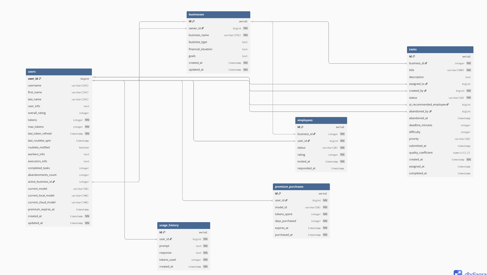

# 🚀 AI Business Manager Bot — Alfa Hack

> A Telegram bot with AI for comprehensive business management

[](https://opensource.org/licenses/MIT)
[](https://www.python.org/downloads/)
[](https://www.postgresql.org/)

**Telegram bot:** [@hackathonchik_bot](https://t.me/hackathonchik_bot)

## 📋 Table of Contents

- [Quick Setup](#-quick-setup)
- [About the Project](#-about-the-project)
- [Key Features](#-key-features)
- [Architecture](#architecture)
- [Alfa-Bank Integration](#-alfa-bank-integration)
- [Database](#-database)
- [Scalability](#-scalability)

## ⚡ Quick Setup

> **Detailed instructions:** See [SETUP.md](SETUP.md) for step-by-step setup in 5 minutes.

## 🎯 About the Project

**@hackathonchik_bot** is an intelligent Telegram bot for managing small and medium-sized businesses with AI integration.

### Problem
- 📊 Lack of accessible financial planning tools
- 👥 Difficulty finding clients and contractors
- 🔄 Inefficient team management
- 💰 High cost of business consultants

### Solution
An AI platform in Telegram for:
- ✅ Automatic financial plan generation
- ✅ Intelligent search for clients and partners
- ✅ Employee and task management
- ✅ 24/7 business consultations

## ✨ Key Features

### 🤖 AI Assistant
- Smart chatbot for business questions
- Contextual help based on the user's business type and personal information
- AI recommendations for tasks
- **Model:** Locally hosted Llama-3-8B-Instruct-Finance-RAG-GGUF, with the option to switch to OpenRouter Llama 3.3 70B Instruct; in both modes, purchasing premium unlocks access to a higher-quality model

### 📊 Financial Planning
- Financial plan based on 4 key questions
- AI analysis and strategy creation
- Professional PDF report
- Industry-specific personalization

### 👥 Team Management
- Hire employees via Telegram username and dismiss them
- Invitation system with confirmation step
- Multi-business support — work under several owners
- Create multiple businesses
- Contractor rating with intelligent matching

### 📋 Task Management
- **AI-assisted executor selection** based on task completion history and time spent
- Statuses: available → in_progress → completed
- Task deadlines and priorities
- Ability to assign work to an employee
- Employees can pick up tasks independently and can decline them
- Owner confirms completion with the option to provide feedback
- Task outcome affects the employee's rating

### 💰 Token System

Internal currency for managing AI usage:

```
Registration → 50 tokens
     ↓
AI request → 1–3 tokens
     ↓
Every 24 hours → 10 tokens added + ability to spin the wheel (max prize: 50 tokens)
```

**Why it exists:**
- 🛡️ Protection against AI abuse
- ⚖️ Fair distribution of resources
- 💰 Monetization opportunity
- 📊 AI cost control

## 🏗️ Architecture

### Overview

```
┌──────────────┐
│  Telegram    │
│    User      │
└──────┬───────┘
       │
   ┌───▼──────────────────────────┐
   │   bot.py                     │──► Telegram handlers, conversation flows
   │   (Telegram Layer)           │
   └───┬──────────────────────────┘
       │
   ┌───▼──────────────────────────┐
   │  Business Logic Layer        │
   │                              │
   │  • ai_client.py          ────┼──► AI requests via OpenRouter
   │  • user_manager.py       ────┼──► Token system, action authorization
   │  • pdf_generator_simple.py───┼──► PDF document generation
   │  • constants.py          ────┼──► Configuration, text strings
   │  • config.py             ────┼──► Environment variables
   └───┬──────────────────────────┘
       │
   ┌───▼──────────────────────────┐
   │   database.py                │──► DAO pattern, CRUD operations
   │   (Data Layer)               │
   └───┬──────────────────────────┘
       │
   ┌───▼──────────┐
   │  PostgreSQL  │
   │      DB      │
   └──────────────┘
```

### Layer Separation Principle

**1. Telegram Flow Layer** — isolated handling of the Telegram API (easily replaceable with a web or mobile app)

**2. Business Logic Layer** — independent modules with no Telegram coupling (usable anywhere)

**3. Data Access Layer** — DAO pattern (easy to migrate to a different DBMS or add caching)

**Advantages:**  
✅ Fast integration — individual modules can be extracted  
✅ Independent layer testing  
✅ Easy replacement of Telegram with a web or mobile app  
✅ Modules can be deployed as microservices

### Technologies

**Backend:** Python 3.10+, python-telegram-bot 21.x, psycopg2  
**Base local AI:** Llama-3-8B-Instruct-Finance-RAG-GGUF  
**Base OpenRouter AI:** z-ai/glm-4.5-air:free  
**Database:** PostgreSQL 12+  
**Documents:** ReportLab, Pillow

## 🏦 Alfa-Bank Integration

### Enhancing AI Through Banking Data

With Alfa-Bank integration, the project will gain **greater autonomy** and **more accurate AI recommendations**.

Access to transactions, turnover, and business financial history will allow AI to:
- 📊 Accurately forecast cash flow and seasonality
- 💡 Optimize expenses based on real spending patterns
- 🎯 Recommend suitable credit products
- 🤖 Operate autonomously without querying the user

**Result:** More precise assistance and a seamless user experience.

### Monetization

- **Freemium** — basic features for free
- **Premium** — advanced AI capabilities (990 ₽/month)
- **Cross-sell** — banking products through the bot
- **Commission** — 0.5–1% of turnover for large businesses

## 🗄️ Database

PostgreSQL 12+ with 5 tables and a clear relationship schema:

### DB Schema



## 📈 Scalability

### Current Architecture (MVP)

```
┌──────────────────────┐
│    Single Server     │
│  Bot + PostgreSQL    │
│  Capacity: ~1K users │
└──────────────────────┘
```

### Scaling to 10K+ Users

```
Load Balancer
    ↓
Bot 1 | Bot 2 | Bot 3  (Horizontal scaling)
    ↓
Redis Cache  (Caching)
    ↓
PostgreSQL Cluster  (Master-Slave)
```

### Scaling to 100K+ Users

```
API Gateway (Rate limiting)
    ↓
Kubernetes Pods (Auto-scaling)
    ↓
Microservices:
├─ AI Service (dedicated service)
├─ DB Cluster (Sharding)
├─ Redis Cluster (Cache + queues)
└─ Message Queue (RabbitMQ/Kafka)
```

## 📋 Bot Commands

### Core Commands

| Command | Description |
|---------|-------------|
| `/start` | Launch the bot and create an account |
| `/help` | Full list of commands |
| `/cancel` | ❌ Cancel the current command |
| `/fill_info` | 📝 Fill in personal information (for job search) |
| `/balance` | Check token balance |
| `/roulette` | 🎰 Daily wheel spin (1–50 tokens) |
| `/export_history` | Export chat history to PDF |

### AI Models

| Command | Description |
|---------|-------------|
| `/my_model` | 🤖 Current AI model |
| `/switch_model` | 🔄 Switch model |
| `/buy_premium` | 💎 Purchase access to premium models (15 tokens/day) |

### Business Management

| Command | Description |
|---------|-------------|
| `/create_business` | Register a new business |
| `/my_businesses` | My businesses |
| `/delete_business` | Delete an existing business |
| `/switch_businesses` | Switch active business |
| `/finance` | Get a financial plan for the active business (💰 3 tokens) |
| `/clients` | AI search for potential clients (💰 2 tokens) |
| `/executors` | AI search for contractors and service providers (💰 2 tokens) |
| `/find_similar` | AI search for partners among users (💰 4 tokens) |

### Team Management

| Command | Description |
|---------|-------------|
| `/find_employees` | 🔍 Find employees (AI matching by business or requirements, 💰 4 tokens) |
| `/add_employee` | Invite an employee |
| `/fire_employee` | Dismiss an employee |
| `/employees` | Employee list |
| `/invitations` | My invitations |
| `/accept` | Accept an invitation |
| `/reject` | Decline an invitation |
| `/my_employers` | My employers |

### Task Management

| Command | Description |
|---------|-------------|
| `/create_task` | Create a task (with AI recommendation) |
| `/available_tasks` | Available tasks |
| `/my_tasks` | My assigned tasks |
| `/all_tasks` | All business tasks (owner only) |
| `/take_task` | Take a task into work |
| `/assign_task` | Assign a task to an employee |
| `/complete_task` | Submit a task for review |
| `/abandon_task` | Abandon a task (−20 to rating) |
| `/submitted_tasks` | Tasks pending review (owner only) |
| `/review_task` | Review and accept/reject a task (owner only) |

## Additional Notes

A conversational mode for chatting with the AI assistant is also available for tokens.

## 🤝 Team

**"Hackaton Advanced"**

**Made with ❤️ for Alfa Hackathon**

*Try the bot: [@hackathonchik_bot](https://t.me/hackathonchik_bot)*
